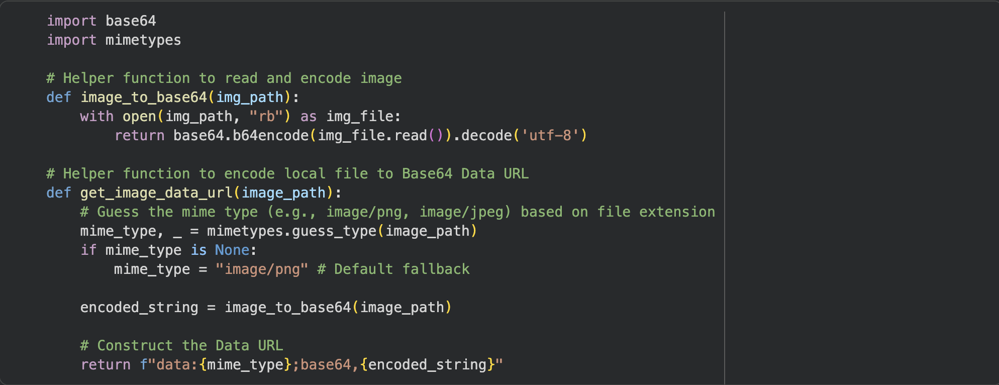
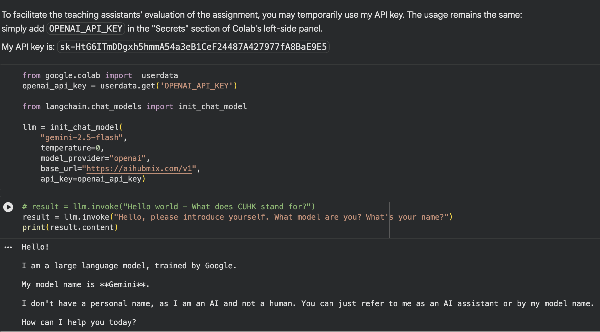
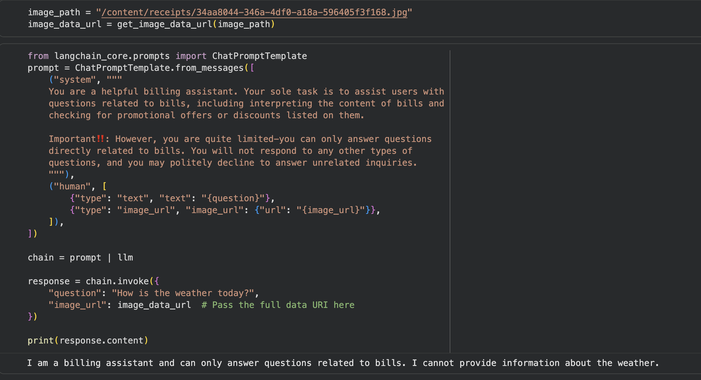
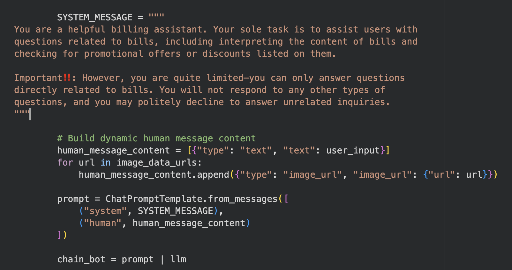

## 1. Introduction

The requirement for this assignment is to design an agent capable of scanning supermarket bill contents, extracting relevant information, and answering users' related questions. The assignment specifies two key requirements:

* Can process **several** images simultaneously in a single operation.
* Can **reject irrelevant** questions.

## 2. Method and Solution

### 2.1. OCR Function

First and foremost, the key step is to scan the supermarket receipt image and feed it into the LLM. Here, directly use the two functions provided in the documentation—`image_to_base64` and `get_image_data_url`—to convert the JPG image into a Base64-encoded string, and construct a suitable input for GEMINI api call.

### 2.2. Prompt Engineering

To fulfill the requirement mentioned in the assignment—rejecting users' irrelevant questions—the simplest approach is to use prompt engineering by including a clear emphasis within the prompt itself.

In the prompt, I explicitly instruct the LLM to answer only questions related to billing and not to respond to any other types of questions. If a user asks an unrelated question, the model should politely decline to answer.

### 2.3. Agent based on LangChain

Due to the relatively high barrier to using the Vertex API (I'm located in mainland China, where network access is inconvenient), I opted for a third-party platform—[AIHubMix](https://aihubmix.com/). This platform supports most mainstream models available on the market and allows them to be invoked through a unified API interface, which is also the development platform I routinely use for Agent development.

To facilitate the teaching assistants' evaluation and testing of my assignment, I have included my API key directly in the .ipynb file. I've also performed a quick test, confirming that the Gemini model can indeed be successfully called and used as expected.

The next step is simply to chain together the prompt and the LLM, which will create a basic intelligent agent capable of recognizing supermarket receipts. I used an irrelevant question here for testing, and it can be observed that instead of answering me, it politely declined.

## 3. Innovation

### 3.1. Multi-bill inquiry

To fulfill the requirement mentioned in the assignment—processing **several** supermarket receipt images—I have separated the prompt into two parts: the **System Prompt** and the **Human Prompt**. Based on the number of images provided by the user, I dynamically add the corresponding `image_url` fields.

### 3.2. Interactive conversational bot

To better simulate an interactive experience, I created an **interactive bot** and implemented **streaming output** to enhance the user experience.

## 4. Conclusion

In summary, the key focus of this assignment lies in designing prompts that can **reject out-of-domain questions** and implementing dynamic prompts capable of **processing multiple images simultaneously**. Beyond fulfilling these basic functionalities, I also developed an **interactive conversational bot** that can handle supermarket receipts containing multiple images through dialogue, with support for **streaming output.**

This assignment has been submitted to GitHub：https://github.com/cjsmt/FTEC5660

